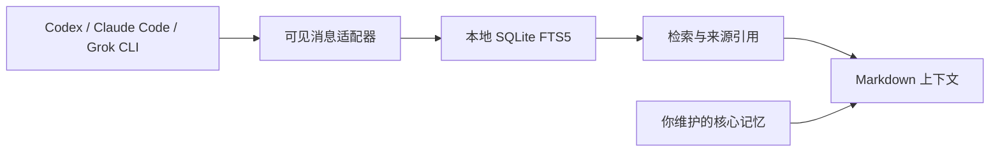

# Sovereign AI Memory

**让 AI 对话成为可检索、可追溯、由你持有的记忆。**

Local-first search and cited context across Codex, Claude Code and Grok CLI conversations.

[](https://github.com/geekhuashan/sovereign-ai-memory/actions/workflows/ci.yml)
[](pyproject.toml)
[](LICENSE)

你在一个 AI 工具里讨论过的决定，换一个工具后还能找到。`sam` 从本地会话中提取可见的用户与助手消息，建立 SQLite 全文索引，再按问题导出带出处的 Markdown 上下文。运行时无需 API Key，也没有模型调用或上传步骤。

> **Alpha · v0.1.0**：这是通用检索核心。会话格式仍可能变化；索引是本地明文，输出脱敏是尽力过滤。它不会自动总结你的人生，也不会把检索结果当作指令执行。

## 先看它能做什么

| 输入 | 操作 | 得到什么 |
| --- | --- | --- |
| 不同 CLI 的本地会话 | `sam ingest` | 统一消息、来源哈希和本地索引 |
| 想找回的关键词 | `sam search SQLite` | 带 vendor / session / message 引用的原始证据 |
| 下一次工作需要的背景 | `sam context SQLite` | 有长度限制、可审阅的 Markdown 上下文 |



## 两分钟演示

需要 **Python 3.11+、SQLite FTS5**。先下载源码，然后运行完全虚构的演示，无需安装依赖：

```sh
git clone https://github.com/geekhuashan/sovereign-ai-memory.git
cd sovereign-ai-memory
python3 examples/demo.py
```

演示在临时目录生成三种格式的会话，调用真实 CLI，并校验检索、来源保持和输出权限。结束后清理临时数据；不会读取你的真实历史。

```text
$ sam ingest
codex: processed 1 source sessions
claude: processed 1 source sessions
grok: processed 1 source sessions
Imported 3 sessions / 6 messages; warnings=0, archived=0, errors=0

$ sam search SQLite --json
6 cited messages across Codex, Claude Code and Grok CLI.

$ sam context SQLite --output context.md
Verified: cited context, private output permissions, unchanged sources, no raw copies.
```

完整可执行示例：[examples/demo.py](examples/demo.py)。上面的检索摘要由演示脚本打印；实际 `--json` 返回结构化消息记录。

## 安装与使用

建议用独立虚拟环境，避免与其他同名 `sam` 命令冲突：

```sh
python3 -m venv .venv
. .venv/bin/activate
python -m pip install .
sam doctor

# 只导入你实际使用的来源；来源不存在会报告失败
sam ingest --vendor codex --vendor claude
sam search "SQLite"
sam search "SQLite" --json
sam context "SQLite" --max-chars 8000 --output .private/context.md
```

运行核心只用 Python 标准库；安装阶段需要 setuptools。Linux 和 macOS 纳入 CI，Windows 尚未验证。

### 本地路径

| 环境变量 | 默认值 / 用途 |
| --- | --- |
| `SAM_CODEX_ROOT` | `~/.codex/sessions` |
| `SAM_CLAUDE_ROOT` | `~/.claude/projects` |
| `SAM_GROK_ROOT` | `~/.grok/sessions` |
| `SAM_PRIVATE_DIR` | `~/.local/share/sovereign-ai-memory`；设置 `XDG_DATA_HOME` 时使用其下同名目录 |
| `SAM_MEMORY_ROOT` | 运行目录下的 `memory`；可选的 `core/*.md` 核心记忆 |
| `SAM_ARCHIVE_ROOT` | 运行目录下的 `raw-archive`，仅显式启用原文复制时使用 |

普通导入只写本地索引和规范化消息。需要额外保留原始文件副本时，明确指定目标：

```sh
sam ingest --vendor codex --archive-raw --raw-root /Volumes/EncryptedArchive/AI
```

该命令不负责加密卷，也不验证目标已加密；完整原文可能包含索引排除的系统、工具与推理事件。默认不复制原文。

### 命令

| 命令 | 用途 |
| --- | --- |
| `sam doctor` | 检查 Python、FTS5，说明当前路径与存储边界 |
| `sam status --json` | 本地来源文件和索引数量 |
| `sam ingest --vendor codex` | 导入选定来源；重复导入替换该来源已有记录 |
| `sam search QUERY --limit 10` | 词法全文检索；不是语义问答 |
| `sam context QUERY --limit 8 --max-chars 16000` | 核心记忆与检索片段组成的上下文 |

## 准确的边界

- 适配的是已支持的本地 CLI 会话格式，不直接访问厂商云端历史。Claude 子代理日志、系统/工具消息和推理块不进入可见消息索引。
- 检索使用 FTS5 与字面匹配回退，不含向量模型。中文尚无专用分词，建议从短词和原文片段开始检索。
- SQLite 和规范化文件保存明文；输出过滤不能保证发现全部秘密或私人信息。分享前仍需审阅。
- 删除来源不会自动清除 SQLite 中的旧记录、导出上下文或备份。保留与重建方法见 [数据处理说明](docs/data-handling.md)。
- 引用和 SHA-256 说明证据来自哪里，不保证历史陈述正确。检索内容是数据，不是指令。

## 开发与路线

```sh
python -m unittest discover -s tests -v
python examples/demo.py
```

近期改进方向：更多格式回归样本、清晰的删除/重建命令、中文检索评估。更大范围的个人资料接入应作为独立集成维护。

[架构](docs/architecture.md) · [数据处理](docs/data-handling.md) · [贡献](CONTRIBUTING.md) · [安全](SECURITY.md) · [更新记录](CHANGELOG.md) · [MIT 许可证](LICENSE)

## English overview

Sovereign AI Memory is a small, local-first CLI for retaining continuity across AI coding tools. It extracts visible conversation messages from supported Codex, Claude Code and Grok CLI session files, indexes them with SQLite FTS5, and creates bounded Markdown context with stable source citations.

Run `python3 examples/demo.py` for a synthetic, temporary end-to-end example. Install with `python -m pip install .` in a virtual environment, then use `sam ingest`, `sam search` and `sam context`. No model API, telemetry or upload is part of the core. The runtime has no third-party dependencies.

The index is plaintext; masking is best-effort. Search is lexical, vendor formats can change, and deletion of a source does not erase previously indexed or exported copies. Review evidence before sharing or feeding it to another model. Contributions should use fabricated fixtures only.
