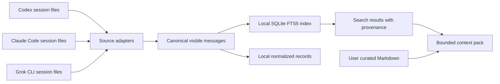

# Architecture

The core has three jobs: normalize visible messages, index them locally, and compose evidence with stable citations.

## Source adapters

Adapters recognize supported local CLI session shapes; they are not vendor cloud APIs. Codex response messages, Claude main-session user/assistant messages, and Grok `chat_history.jsonl` messages are supported. System/tool messages and reasoning blocks are excluded. Claude subagent logs are excluded from discovery.

Each adapter parses a single in-memory byte snapshot of one source file and computes the SHA-256 from those same bytes. Large individual session files therefore require corresponding memory; new messages appended after the snapshot appear on a later import.

Each canonical message retains its vendor, session ID, role, source-relative line reference, source SHA-256 and a stable message ID. The [schema](../schemas/canonical-message.schema.json) describes this interchange format. A source hash identifies the imported file bytes, not the truth of a recorded claim.

## Storage and search

SQLite FTS5 stores the text index. Re-importing a source replaces that source's indexed messages instead of duplicating them. Normalized JSONL records are a local representation, not a separate source of truth. Runtime data is deliberately outside the installed Python package.

Search uses lexical FTS5 queries with a literal fallback. It does not use embeddings, a reranker or a generative answer model. Unicode tokenization is not dedicated Chinese word segmentation; short literal Chinese phrases are often more useful than long natural-language questions.

## Context

A context pack combines optional `core/*.md` files with matching history. It includes a trust-boundary notice and vendor/session/message citations. Character limits bound output; truncation may cut a passage. It is plain Markdown suitable for inspection and selective copying into another tool.

The CLI does not execute text found in a session or automatically promote it into durable memory. Automatic memory extraction, sync services, NAS orchestration and private life-data integrations are outside this public core.
